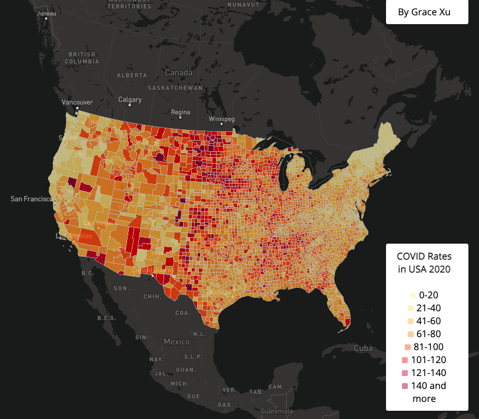
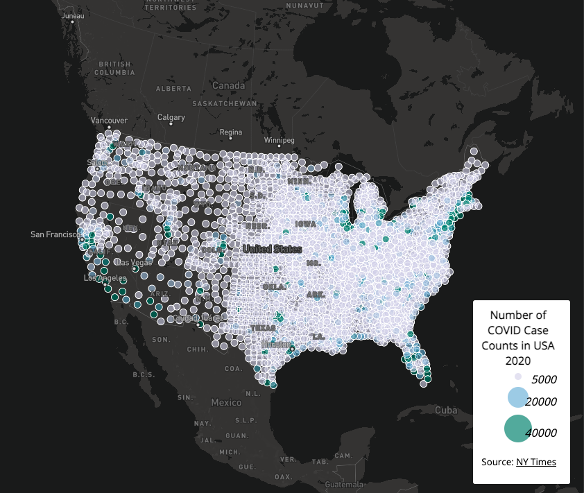

# COVID mapping
## by Grace Xu
## a brief introduction, links to the map, screenshots, the primary functions(especially the function which was not covered in the lectures), libraries in use, data sources, credit

This Project is on Mapping COVID of 2020 in the United States. I have made 2 maps, one a cholorepeth map on the COVID rates. The other is a proportional symbols map of covid-19 cases.

### Cholorepeth map on the COVID rates

This map presents the data of covid rates per thousand residents in US. The data ranges from 0 to 147, I have organized them into 8 intervals, incrementing by 20, from lighter yeloow to darker red. The lighter the color, the lower rate, the darker the color the higher rate. My map presents that the middle of the country has higher rates of COVID than both the West and East Coast. The COVID rate will popup when click on the area in the map.

### Proportional symbols map of covid-19 incidences

This map presents the data of covid counts in US. The data ranges from 5000 to 40000, I have organized them into 3 intervals, from lighter blue to darker green. The lighter the color, the lower incidences, the darker the color the higher incidences. Unlike the COVID rates Cholorepeth map presents where higher rates are more found in the middle of the country, this map presents that the most incidences appear in New York, Florida and along the waters in California. The COVID rate will popup when click on the area in the map.

### Acknowledgment

- Map Projection: Albers
- Library in Use: Mapbox GL JS

### Data Source

- [New York Times](https://github.com/nytimes/covid-19-data/blob/43d32dde2f87bd4dafbb7d23f5d9e878124018b8/live/us-counties.csv) provided us the COVID-19 case/death data

- [U.S. Census Bureau](https://www.census.gov/geographies/mapping-files/time-series/geo/carto-boundary-file.html) provided us the U.S. county boundary shapefile

- [2018 ACS 5 year estimates](https://data.census.gov/cedsci/table?g=0100000US%24050000&d=ACS%205-Year%20Estimates%20Data%20Profiles&tid=ACSDP5Y2018.DP05&hidePreview=true) provided us the population data